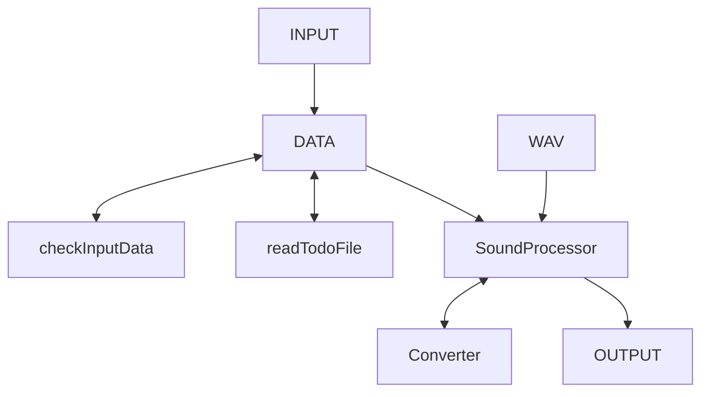

# что нужно сделать 

## classes
- data - хранит все входные и выходные данные
- wav
- proccessor -> (mix, mute, random)

## что реализовать в кажом классе
<s> ### wav 
- конструктор
- чтение заголовка
- чтение сэмплов
- хранение сэмплов
- запись заголовка

### processor
- парсинг команд
- применение команды и генерация класса 

### data
- обработку входных данных и их хранение </s>

## фичи
<s>- добавить цвета в вывод консоли:
    0: Черный
    1: Синий
    2: Зеленый
    3: Голубой
    4: Красный
    5: Пурпурный
    6: Желтый
    7: Белый
    8: Серый
    9: Светло-синий
    10: Светло-зеленый
    11: Светло-голубой
    12: Светло-красный
    13: Светло-пурпурный
    14: Светло-желтый
    15: Светло-белый
- добавить в -h команду полное описание использования команды</s>